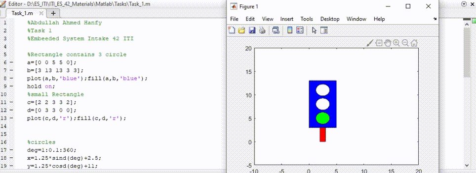

# Trafic lighting Task

## uploading Task 1 for matlab course.
  ### -In this task I had Implemented a simple traffic light
  ### -It was jut ploting a simple shapes like Rectangle and circle
  ### -using aslo a while loop to implement lighting of cirlcles.
  
  
## This is Demo for the Task

